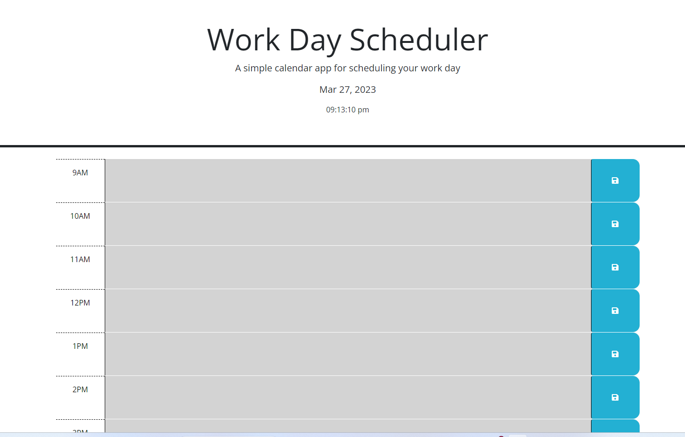

## Description 
Create a simple calendar application that allows a user to save events for each hour of the day by modifying starter code. This app will run in the browser and feature dynamically updated HTML and CSS powered by jQuery.

## Project URL
  https://github.com/csherman177/workScheduler

## Deployment
  https://csherman177.github.io/workScheduler/ 

## Demo/Screenshots
  <table>
  <tr>
    <td>Password Generator Screenshot</td>
  </tr>
  <tr>
    <td></td>
  </tr>
  </table>
 
  ## Contact
  Email: csherman177@gmail.com

  ## Author
  Author(s): Courtney Sherman 
  GitHub: https://github.com/csherman177/ 